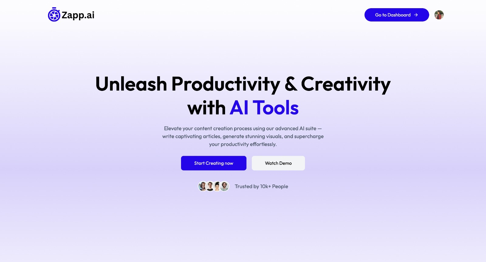
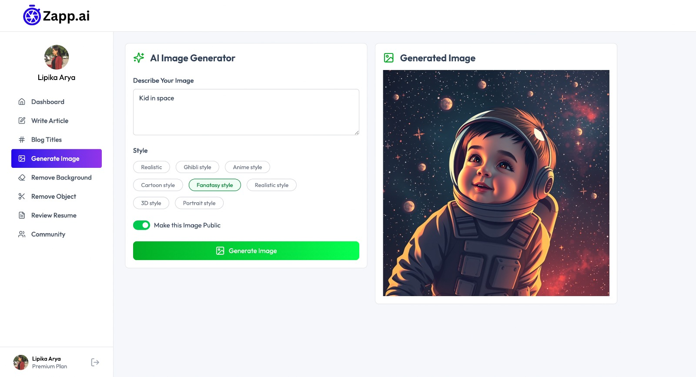
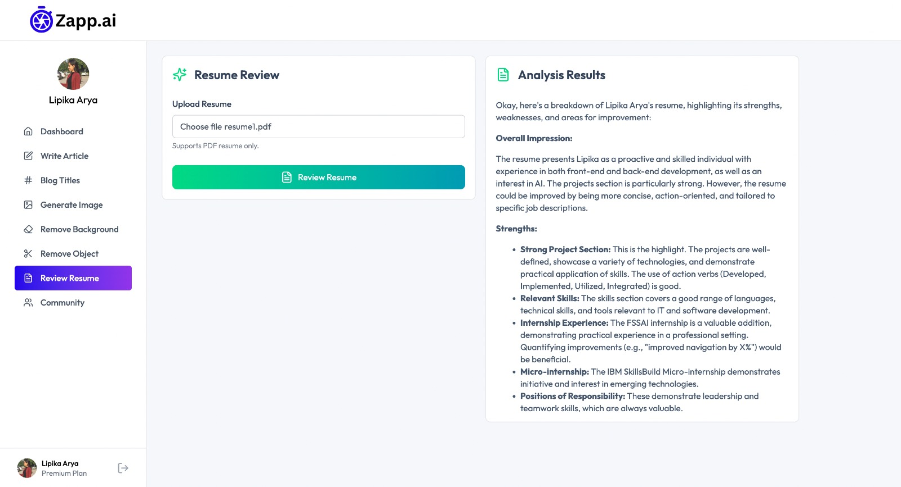

# ⚡ Zapp.ai - AI SaaS App

**ZAPP-AI** is a powerful AI SaaS application that offers a suite of AI-driven tools to streamline your content and image workflows — from article and blog generation to resume reviews and image manipulation. Built with **React**, **Node.js**, **Clerk**, and **Gemini API**, it combines performance with simplicity.

## 📸 Preview

### 📌 Landing Page

### 📌 Generate Image Page

### 📌 Resume Review Page

## 🛠️ Tech Stack

- **Frontend:** React, Tailwind CSS
- **Backend:** Node.js, Express
- **Authentication:** Clerk
- **Database:** PostgreSQL via Neon DB
- **File Uploads:** Multer
- **Image Hosting:** Cloudinary
- **AI Features:** Gemini API (from Google)
  

## ✨ Features

- 🧠 **Write Articles** – Generate long-form articles using AI
- 📝 **Generate Blog Titles** – Instantly get AI-generated catchy titles
- 🖼️ **Generate Images** – Create AI-powered images from prompts
- 🪄 **Remove Image Backgrounds** – One-click background removal
- 🎯 **Remove Image Objects** – Select and erase objects from images
- 📄 **Resume Review** – Get smart feedback and insights on your resume
- 💳 **Subscription Management** – Unlock premium AI features with secure Clerk-managed subscriptions
